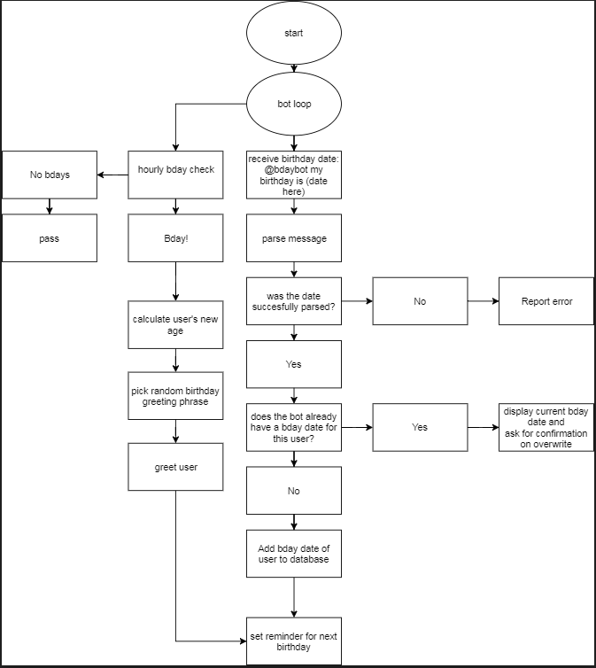

# Birthday Bot (*bdaybot*)
> Slack birthday management and greeting bot.

The concept is simple. Tell the bot your birthday and when it comes around, get a nice little birthday message.

![Python version][python-version]
[![Build Status][travis-image]][travis-url]
[![GitHub issues][issues-image]][issues-url]
[![GitHub forks][fork-image]][fork-url]
[![GitHub Stars][stars-image]][stars-url]
[![License][license-image]][license-url]

## Design Concept


## Intial Setup
```bash
git clone https://github.com/clamytoe/bdaybot.git
cd bdaybot
```

### Python VENV Environment

```bash
python3 -m venv venv
source ./venv/bin/activate
pip install -r requirements.txt
```

### Anaconda Development Environment

```bash
conda env create -f environment.yml
source activate bdaybot
```

[python-version]:https://img.shields.io/badge/python-3.6%2B-brightgreen.svg
[travis-image]:https://travis-ci.org/clamytoe/pguide.svg?branch=master
[travis-url]:https://travis-ci.org/clamytoe/pguide
[issues-image]:https://img.shields.io/github/issues/clamytoe/bdaybot.svg
[issues-url]:https://github.com/clamytoe/bdaybot/issues
[fork-image]:https://img.shields.io/github/forks/clamytoe/bdaybot.svg
[fork-url]:https://github.com/clamytoe/bdaybot/network
[stars-image]:https://img.shields.io/github/stars/clamytoe/bdaybot.svg
[stars-url]:https://github.com/clamytoe/bdaybot/stargazers
[license-image]:https://img.shields.io/github/license/clamytoe/bdaybot.svg
[license-url]:https://github.com/clamytoe/bdaybot/blob/master/LICENSE
