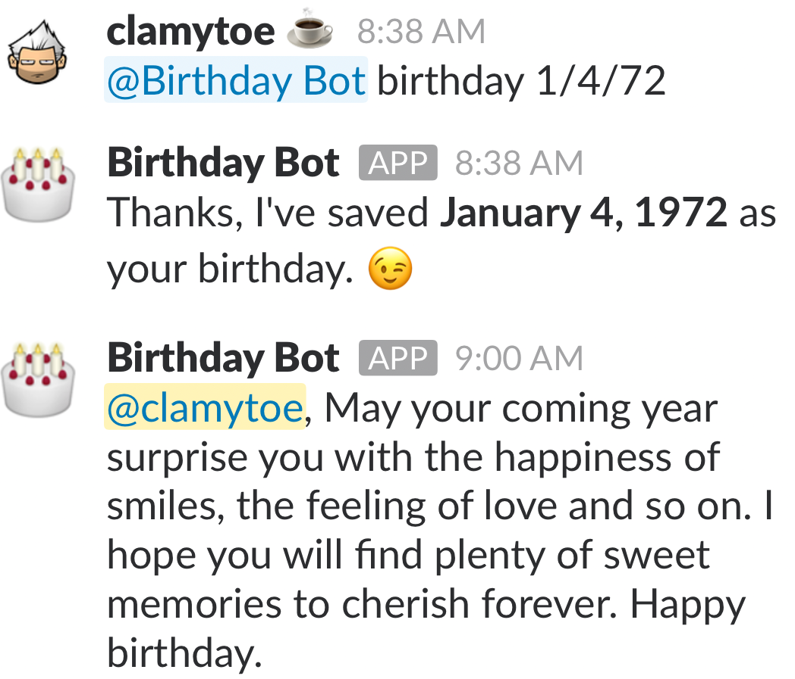
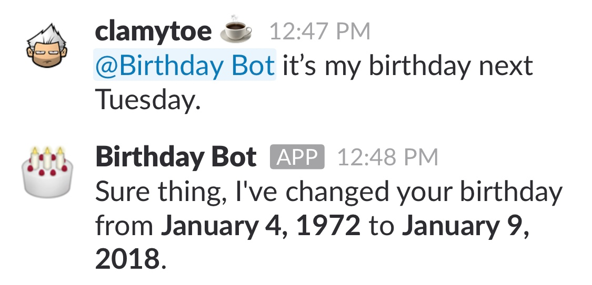

# Birthday Bot (*bdaybot*)
> Slack birthday management and greeting bot.

The concept is simple. Tell the bot your birthday and when it comes around, get a nice little birthday message.

![Python version][python-version]
[![Build Status][travis-image]][travis-url]
[![BCH compliance][bch-image]][bch-url]
[![GitHub issues][issues-image]][issues-url]
[![GitHub forks][fork-image]][fork-url]
[![GitHub Stars][stars-image]][stars-url]
[![License][license-image]][license-url]

## Design Concept


## Intial Setup
```bash
git clone https://github.com/clamytoe/bdaybot.git
cd bdaybot
```

### Python VENV Environment

```bash
python3 -m venv venv
source ./venv/bin/activate
pip install -r requirements.txt
```

### Anaconda Development Environment

```bash
conda env create -f environment.yml
source activate bdaybot
```

### How to use
Before you can start the bot you are going to have to set a couple of environment variables on your system:

**BOT_ID** and **SLACK_BOT_TOKEN**

Once the bot is up and running and you've added it to one of your slack channels, it'll simply respond to any message directed towards it. It's not smart, any message to it should contain the **birthday** keyword.



If a date is not included in the message and you have already given it your birthday before, it will return the number of days left for it.


Now it is pretty smart about filtering out different date formats, it just defaults to accepting the month before the day; sorry International users! You don't even have to supply a year for that matter!



It automatically takes into account the users TimeZone and will give them a random birthday message at 09:00AM their local time. We didn't want it to wake anybody up at midnight!

[python-version]:https://img.shields.io/badge/python-3.6%2B-brightgreen.svg
[travis-image]:https://travis-ci.org/clamytoe/pguide.svg?branch=master
[travis-url]:https://travis-ci.org/clamytoe/pguide
[bch-image]:https://bettercodehub.com/edge/badge/clamytoe/bdaybot?branch=master
[bch-url]:https://bettercodehub.com/
[issues-image]:https://img.shields.io/github/issues/clamytoe/bdaybot.svg
[issues-url]:https://github.com/clamytoe/bdaybot/issues
[fork-image]:https://img.shields.io/github/forks/clamytoe/bdaybot.svg
[fork-url]:https://github.com/clamytoe/bdaybot/network
[stars-image]:https://img.shields.io/github/stars/clamytoe/bdaybot.svg
[stars-url]:https://github.com/clamytoe/bdaybot/stargazers
[license-image]:https://img.shields.io/github/license/clamytoe/bdaybot.svg
[license-url]:https://github.com/clamytoe/bdaybot/blob/master/LICENSE
